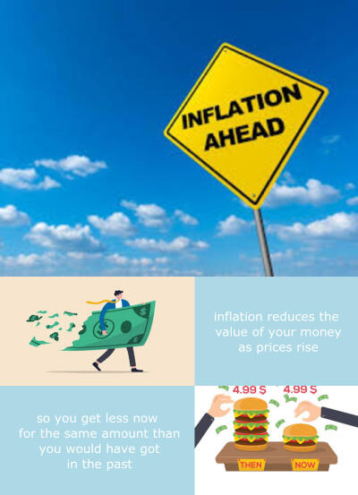

# My STATS 220 Assignment 1 Page

## Introduction

Welcome to my STATS 220 Assignment 1 page. For my assignment, I have used R to create a meme about inflation as it is very topical at the moment due to prices increasing for many everyday products. To create my meme:

- I have obtained some pictures online that help explain how inflation affects people. 
- In addition, I have used the magick package within R to combine pictures and blank images with writing together into one overall image.

## My meme

I have created a meme about inflation and its impacts as it is a topical issue at the moment. It is more educational than funny, but hopefully will give readers an idea of the basic impacts of inflation on everyday life. Some of these impacts are:

1. You are unable to purchase as much of an item now with the same amount of money than you could in the past
2. Or companies shrink the amount of an item they sell to avoid raising prices
3. Or if you earn interest income on an investment, inflation reduces the amount you are able to buy with the earnings

**For more information** about inflation, please visit the [Reserve Bank of New Zealand website](https://www.rbnz.govt.nz/monetary-policy/inflation).



## The R code used to create my meme

```
    library(magick)
    intro_box <- image_read('inflation1.png') %>%
      image_resize('600x400')
    inf_img1 <- image_read('inflation2.png') %>%
      image_resize('715x600')
    blank1 <- image_blank(600, 400, 'light blue') %>%
      image_annotate(text = 'inflation reduces the\n value of your money\n as prices rise',
                 color = 'white',
                 size = 45,
                 font = 'Verdana',
                 gravity = 'center')
    inf_img2 <- image_read('inflation4.png') %>%
      image_resize('600x400')
    blank2 <- image_blank(715, 400,'light blue') %>%
      image_annotate(text = 'so you get less now\n for the same amount than\n you would have got\n in the past',
                 color = 'white',
                 size = 45,
                 font = 'Verdana',
                 gravity = 'center')
                 

    top_row <- image_append(intro_box) %>%
      image_scale(400)
    second_row <- image_append(c(inf_img1, blank1)) %>%
      image_scale(400)
    third_row <- image_append(c(blank2, inf_img2)) %>%
      image_scale(400)
    final_img <- c(top_row, second_row, third_row) %>%
      image_append(stack = TRUE)
    image_write(final_img, 'meme.png')  
```
